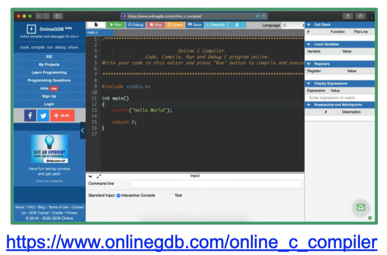

### ENTORNO DE DESARROLLO

---

En la actualidad se presentan una amplia variedad de herramientas mediante las cuales podemos trabajar el lenguaje C

### Online

Sin necesidad de instalación, los compiladores online son una alternativa a programar y experimentar en un entorno sin obligatoriamente descargar la herramienta o IDE. 

Algunas de estas herramientas se presentan en las imágenes a continuación: 

  

Si bien en este módulo de contenido no se menciona o introduce directamente a la programación en C, el ejemplo más básico y común es el conocido "Hola Mundo". 